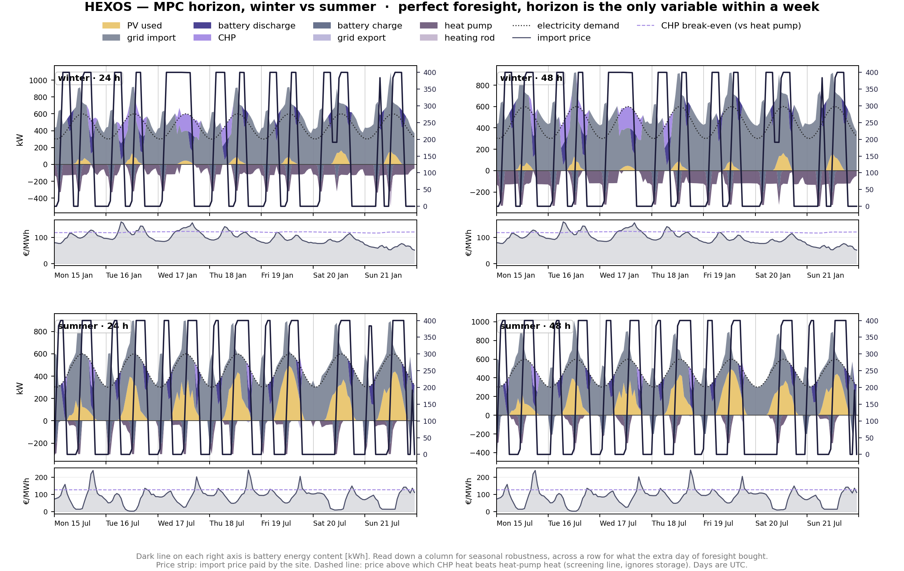

# HEXOS — Multi-Energy Dispatch Optimizer

HEXOS works out the cheapest way to run an industrial site's energy system,
hour by hour. A factory or campus with its own solar, combined heat-and-power
(CHP) units, heat pumps, boilers, and batteries has to decide constantly where
its electricity and heat should come from — and doing that well, against
changing prices and weather, can save real money. HEXOS makes that decision
automatically by solving it as an optimization problem instead of following
fixed rules.

Under the hood it's a Mixed-Integer Linear Program, written in Python with
[Pyomo](https://pyomo.org) and solved using [HiGHS](https://highs.dev). Most of
the model is linear, but the CHP on/off choices are yes/no decisions — that's
the "integer" part — along with realistic constraints like minimum runtime,
ramp limits, and start-up costs.

## What it does

- Optimizes a full year (8,757 hours) at once, using a rolling-horizon solver
  that keeps it tractable — the whole year solves in about two minutes.

- Runs on real data: German day-ahead electricity prices (OPSD), Munich weather
  (EnergyPlus), and heat-demand and heat-pump efficiency profiles (When2Heat).

- Includes a closed-loop Model Predictive Control simulation that tests how the
  system performs when it has to rely on imperfect forecasts. With hourly re-planning,
  that uncertainty costs under 0.1% against a perfect-foresight benchmark on the 2019 data.

- Quantifies the euro value of battery flexibility through a controlled
  full-year experiment that toggles only the battery, holding everything else
  fixed — isolating ~€5,500/yr (about 1.3% of annual operating cost).

- Forecasts day-ahead prices probabilistically (P10/P50/P90) with a
  walk-forward backtest, and calibrates the prediction intervals using conformal
  prediction so the 80% band actually holds ~80% coverage (79.6% out-of-sample,
  up from 59.4% raw).

- Runs a study on how much the heat pump's efficiency modelling actually affects
  the results — a small but real modelling-fidelity question.

- Turns the optimiser into a price-responsive day-ahead bidder for the site's
  own demand: stepwise bid curves built by parametric solves over the P10–P90
  price band, made monotone with isotonic regression, and settled against
  realised 2019 German day-ahead prices next to a committed-volume baseline and
  a perfect-foresight yardstick. HEXOS stays a price-taker here; it is demand-
  side bidding, not a trading strategy.

- Tests whether one day of MPC foresight is enough by running 24 h and 48 h
  horizons over four seasonal weeks with perfect forecasts, so horizon length
  is the only thing that changes. The result is reported as a range across
  seasons rather than a single week.

- Comes with an interactive dashboard (Streamlit + Plotly) where you can pick a
  real day, switch technologies on and off, and solve it live. Results are saved
  to a PostgreSQL database so you can compare past runs.

- Backed by a 76-test pytest suite, run by GitHub Actions on every push,
  covering storage continuity, constraint satisfaction, energy-balance
  invariants, MPC behaviour, and the bidding layer (monotone curves,
  settlement, ordering against perfect foresight).

## Getting started

```bash
python -m venv .venv && source .venv/bin/activate   # Windows: .venv\Scripts\activate
pip install -r requirements.txt
pytest -q                                           # should show 76 passing
streamlit run app/streamlit_app.py                  # launch the dashboard
```

The full-year scenarios need the raw datasets — `data/raw/README_DOWNLOAD.md`
explains where to get them. The database features are optional; the app runs
fine without one, and `SETUP_DATABASE.md` covers the setup if you want them.

## One week, two seasons, two horizons



One winter and one summer week of 2024 day-ahead prices (Energy-Charts), each
solved with a 24 h and a 48 h MPC horizon under perfect foresight. Sources of
electricity stack above zero, sinks other than demand below it, and the dark
line is battery energy content. The strip under each panel is the import price
with the CHP break-even price. Reproduce with:

```bash
python scenarios/run_horizon_sweep.py --data 2024
python scenarios/plot_horizon_sweep.py --tag DE_2024 --seasons winter,summer --with-price
python scenarios/key_hours.py --tag DE_2024        # the numbers behind the picture
```

## Scope

HEXOS is an offline optimization and control-strategy engine — it works out and
tests the best schedule, but it isn't wired to live hardware and doesn't run a
plant in real time. It also isn't a trading tool or an equipment-sizing tool;
the goal is simply to minimize a site's operating cost.

## Provenance

This is an independent, clean-room implementation built from published
energy-system optimization methods and open datasets. It contains no
proprietary code, and the example plant uses realistic but fictional values.

## License

Released under the MIT License — see the `LICENSE` file.
